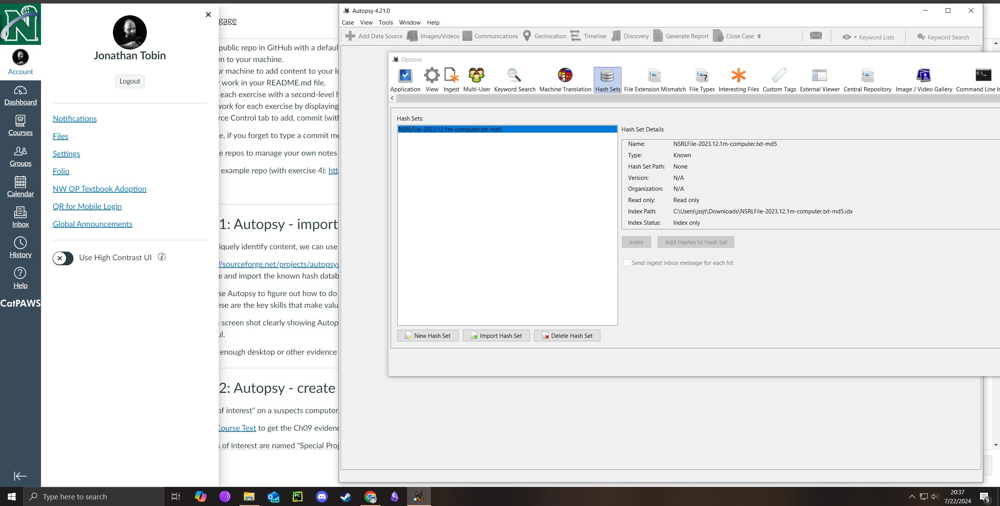
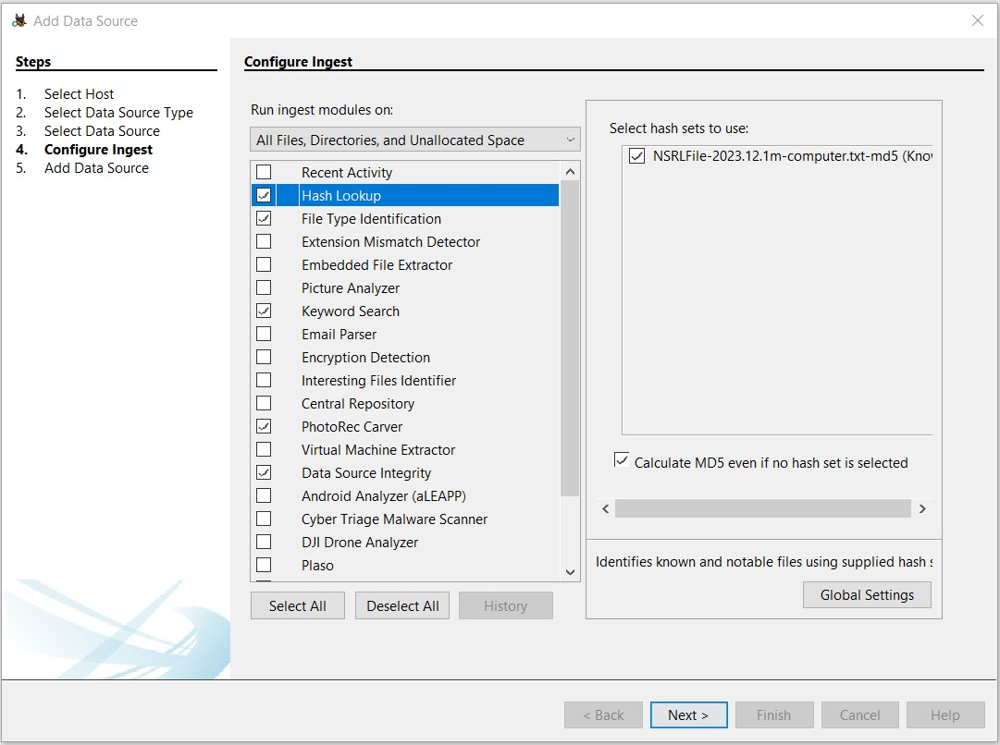
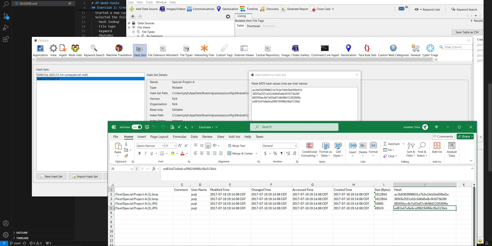
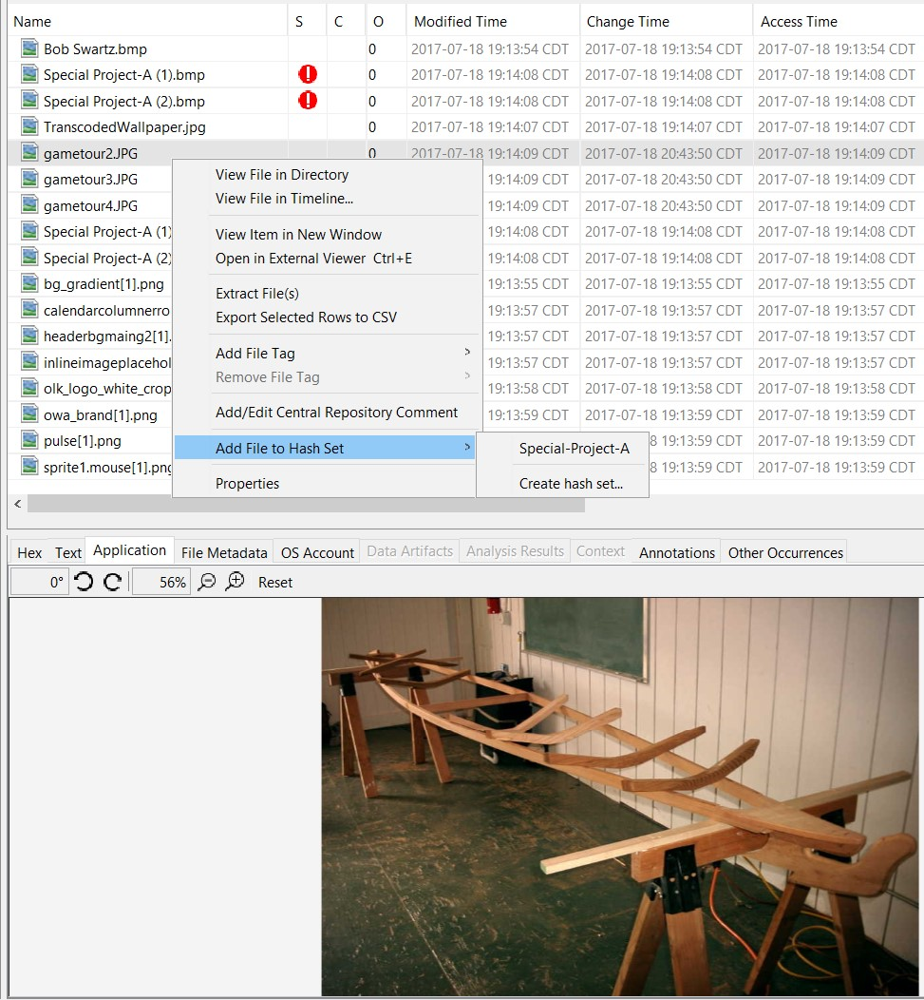
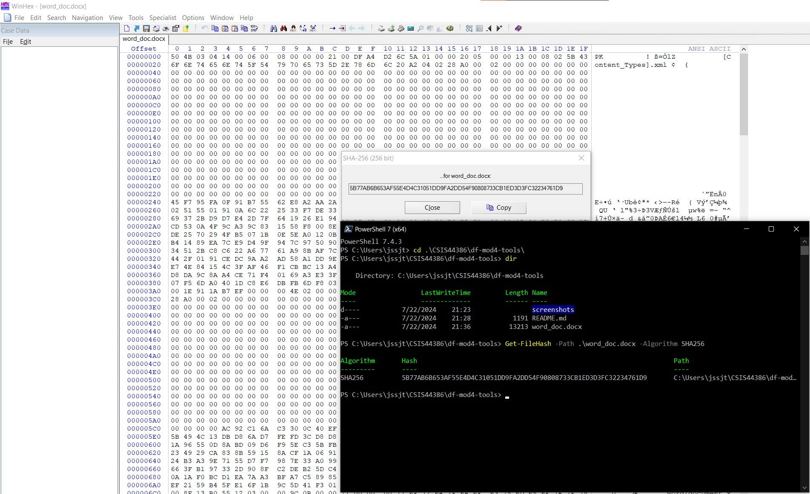
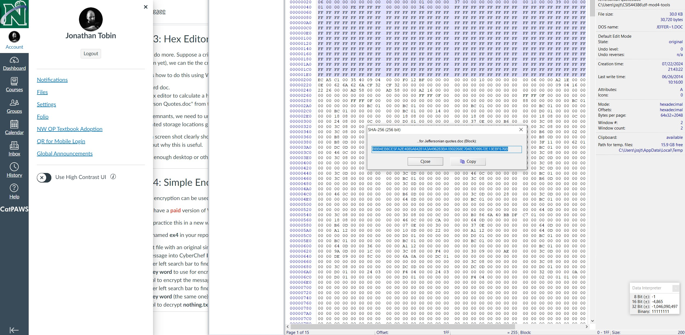
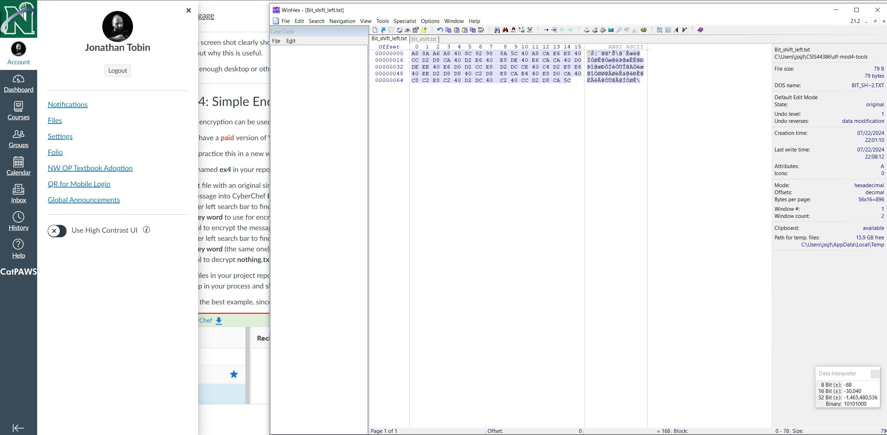

# df-mod4-tools
Repo for testing Autopsy hash tools

## Exercise 1: Import Hash into Autopsy

- Imported the NSRL hash file into Autopsy.

## Exercise 2: Create Hash database of evidence

- Started a new case w/ Chapter 9 image file
- Selected the follow ingest modules: (pic E2-1)
  - Hash lookup
  - FIle type
  - Keyword
  - PhotoRec
  - Data source integrity
  

- Tagged the pictures as notable and generated a report (pic E2-2)

- Added the notable file hashes to a new local hash set from a report (pic E2-3)
- Autopsy flagged another file named 'gametour3.jpg' which was important.  This led to a couple of other gametour files that I added to the hash from R Click > Add to Hash Set.  It doesn't seem to refresh this, though.  It looks like you have to re-run the hash set ingest.  Kind of annoying!
- 

## Exercise 3: 

- created a word doc, word_doc.docx, and added some dummy text.
- WinHex was used to get the file hash value, and cross referenced against PS7 hash, both SHA256.

- Opened the Jefferson quotes doc and used WinHex to get the SHA256 hash of the first sector 00 00 - 01 FF
  

## Exercise 4: Bit Shifting

- Created a sample text file: bit_shift.txt from course text
- Used Winhex to do a bit-shift-left on the above text file to "encrypt" it.  Saved as bit_shift_left.txt
